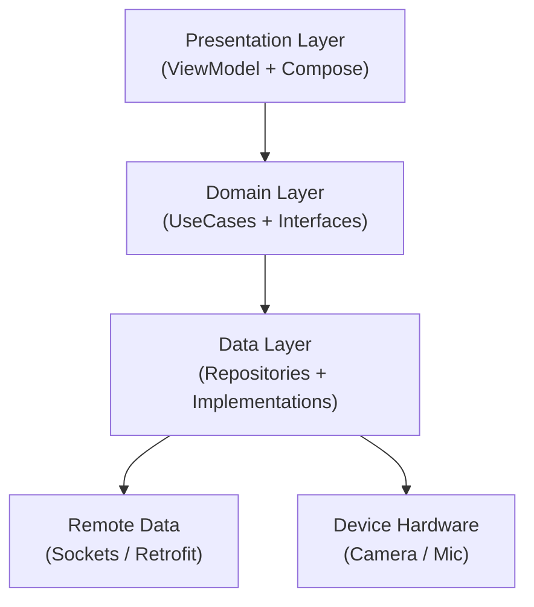
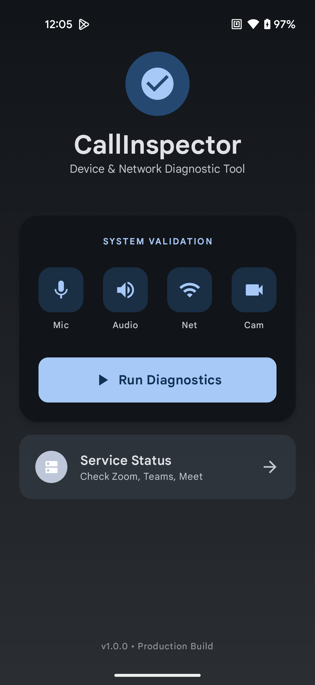
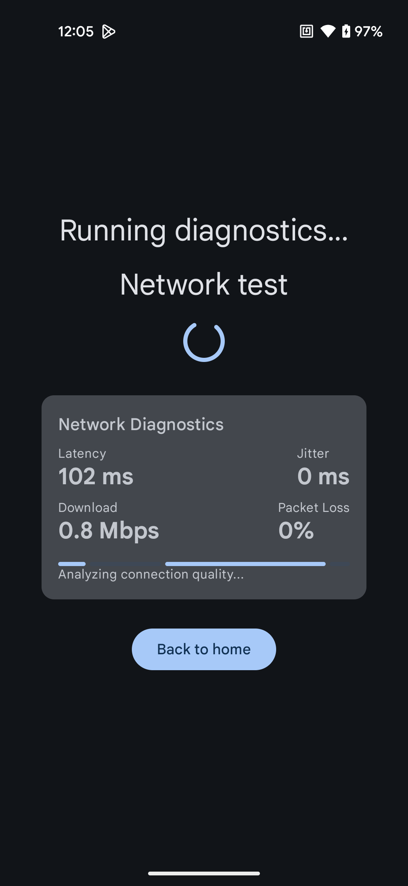
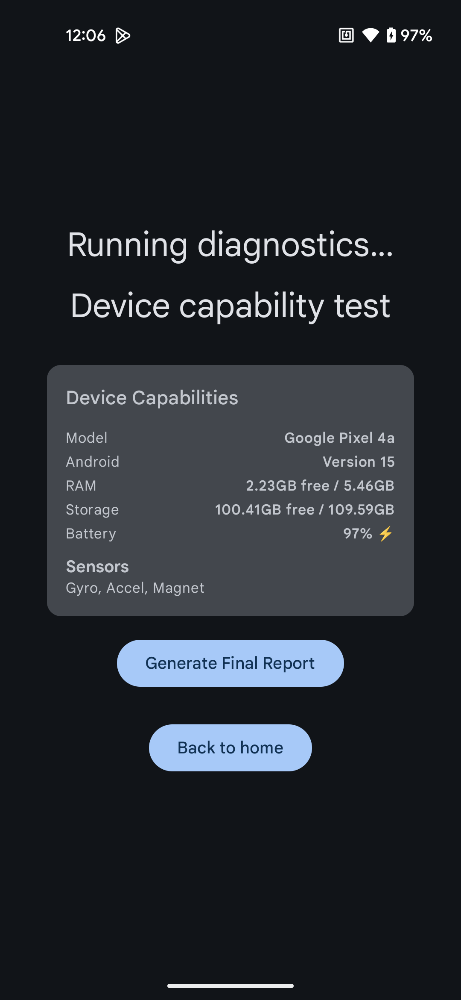
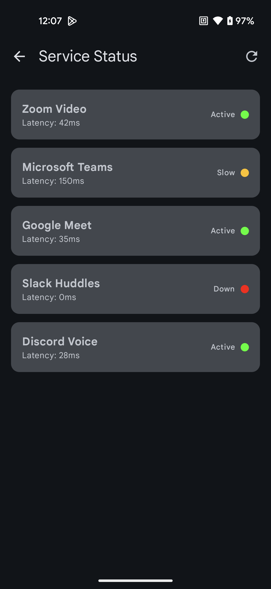
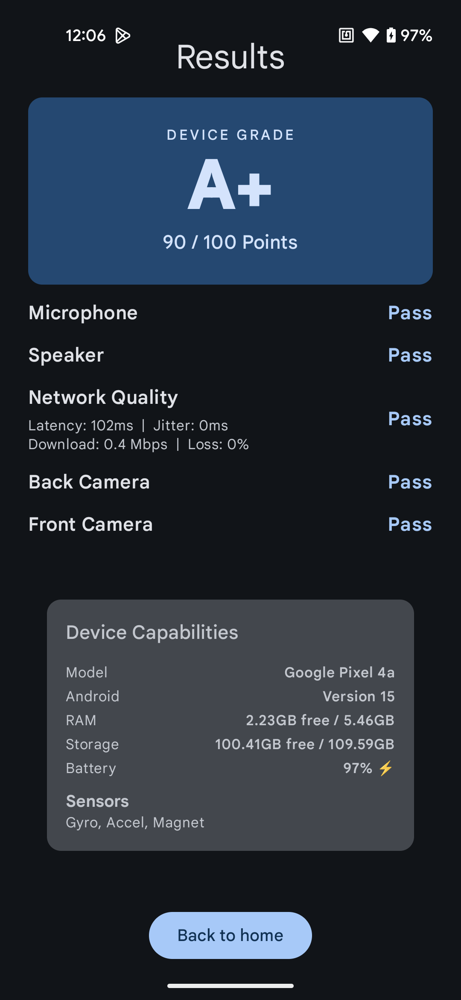

# 🕵️‍♂️ CallInspector

**CallInspector** is a modular, production-grade diagnostic engine designed to validate Android device hardware and network integrity before critical video calls.

It goes beyond simple API checks by implementing **low-level socket probes**, **automated hardware analysis**, and **mathematical scoring models** to grade device health.

---

## 🚀 Key Features

### 📡 Network Diagnostic Engine
Instead of relying on simple HTTP checks, CallInspector implements a custom networking stack:
* **TCP Socket Probes:** Measures raw TCP handshake latency to bypass ICMP restrictions.
* **Jitter Calculation:** Computes variance between packet arrivals in real-time.
* **Throughput Testing:** Streams data from a dedicated CDN to measure true bandwidth.
* **Packet Loss Estimation:** Detects dropped socket connections.

### 📸 Automated Sensor Validation
* **CameraX ImageAnalysis:** Uses background threads to analyze pixel luminosity buffers (`YUV_420_888`) to mathematically verify if the lens is functioning or covered.
* **Microphone Amplitude:** Visualizes raw audio input levels using `MediaRecorder`.

### 📦 Dynamic Feature Module
Demonstrates advanced modularization capabilities:
* **Service Status Dashboard:** A completely separate module (`:dynamic_status_module`) delivered via **Play Feature Delivery**.
* **Architecture:** Implements the **"Logic in Base, UI in Dynamic"** pattern to solve Hilt dependency graph constraints while keeping the APK size optimized.

### 📊 Health Scoring Algorithm
* Aggregates 15+ metrics into a weighted score (0-100).
* Generates a final "Device Grade" (A+ to F).
* Logic verified by **Unit Tests** using Mockk.

---

## 🛠 Tech Stack

| Category | Library / Technology | Usage |
| :--- | :--- | :--- |
| **Language** | [Kotlin](https://kotlinlang.org/) | 100% Codebase |
| **UI** | [Jetpack Compose](https://developer.android.com/jetpack/compose) | Material3 Design System |
| **Architecture** | **MVI / Clean Architecture** | Unidirectional Data Flow |
| **Injection** | [Hilt](https://dagger.dev/hilt/) | Dependency Injection |
| **Concurrency** | [Coroutines + Flow](https://kotlinlang.org/docs/coroutines-overview.html) | Reactive Data Streams |
| **Networking** | [Retrofit](https://square.github.io/retrofit/) + **Java Sockets** | API & Latency Probes |
| **Hardware** | [CameraX](https://developer.android.com/training/camerax) | Hardware Abstraction |
| **Testing** | [Mockk](https://mockk.io/) + [Turbine](https://github.com/cashapp/turbine) | Unit Testing Flows & Logic |

---
## 🏗 Architecture Overview

The app follows strict **Clean Architecture** principles to ensure testability and separation of concerns.

---
## 📸 Screenshots

| **Dashboard** | **Diagnostics** |
|:---:|:---:|
|  |  |
| *Status Check & Features* | *Real-time Socket Analysis* |

| **Device Capabilities** | **Service Status (DFM)** |
|:---:|:---:|
|  |  |
| *Hardware Audit* | *Dynamic Feature Module* |

| **Final Report** |
|:---:|
|  |
| *Automated Scoring Engine* |

---

